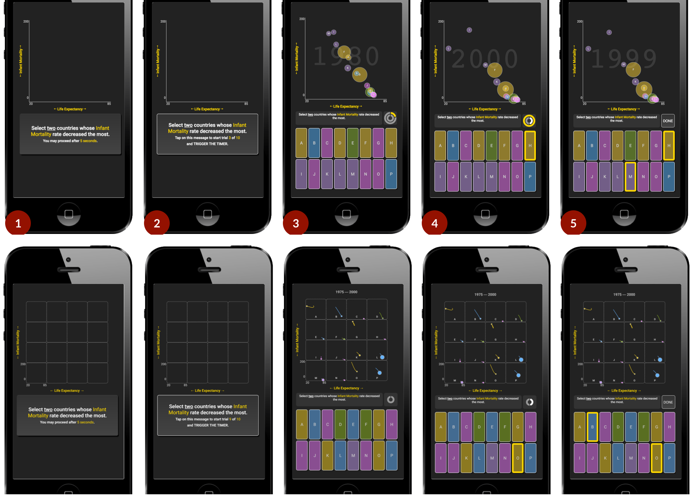

# A Comparative Evaluation of Animation and Small Multiples For Trend Visualization on Mobile Phones

This repository contains supplemental material for a research paper **A Comparative Evaluation of Animation and Small Multiples For Trend Visualization on Mobile Phones** by [Matthew Brehmer (Microsoft Research)](mailto:mabrehme@microsoft.com), [Bongshin Lee (Microsoft Research)](mailto:bongshin@microsoft.com), [Petra Isenberg (Inria)](mailto:petra.isenberg@inria.fr), and [Eun Kyoung Choe (University of Maryland)](mailto:choe@umd.edu). 

It contains including source code for software used in an experiment as well as [experimental data and analysis scripts](data_analysis).

<!-- This repository also includes [high-resolution versions of the paper figures](PaperFigures); figures 2-12 were generated with [ggplot2](https://ggplot2.tidyverse.org/) (see [plot_paper_figures.R](StudyDataAnalysis/plot_paper_figures.R)). This repository also contains [mobile screen capture videos](SupplementalVideos) of two experimental sessions (one with Temperature data and a second with Sleep data); the videos were recorded using an iPhone 5s running the Chrome mobile browser, with iOS accessibility controls toggled to show the touch point.     -->

**Figure**: The five stages of a single task, as experienced in the Animation condition (top) and in the Multiples condition (bottom), comprised of a task instruction reading phase (Steps 1–2) and a task completion phase (Steps 3–5).

This repository is maintained by [Matthew Brehmer](https://github.com/mattbrehmer).

## Experiment Application Source Code

A mobile-only web application for evaluating animated and faceted versions of bubble charts. 

An instance of the application is running at [aka.ms/multiples](http://aka.ms/multiples), which can be viewed device running the Chrome or Safari mobile web browser.

### Setup / Testing

1. Open a terminal and navigate to this directory

2. Ensure that [nodejs](https://nodejs.org/) is installed

3. Install the necessary packages with `npm install`

4. Start the node server with: `npm start`

5. Open [localhost:8080](http://localhost:8080/) in Chrome. For emulating a mobile usage environment, launch the Chrome debugger (`CTRL + SHIFT + J`) and toggle the device emulator (`CTRL + SHIFT + M`); select your desired mobile device. Note that the application will only be visible in portrait mode in the mobile emulator. 

### Icon Attribution

The application incorporates (and modifies) the following [CC BY 3.0](https://creativecommons.org/licenses/by/3.0/) icons from [the Noun Project](https://thenounproject.com/):
- [Hand Holding Smartphone #1248199](https://thenounproject.com/icon/1248199/) by UNiCORN
- [Portrait Orientation #456515](https://thenounproject.com/icon/456515/) by Guilhem
- [Phone Brightness #753458](https://thenounproject.com/icon/753458/) by corpus delicti
- [Brightness #662615](https://thenounproject.com/icon/662615/) by Creaticca Creative Agency
- [Wifi #688371](https://thenounproject.com/icon/688371/) by Kid A
- [Battery #1099945](https://thenounproject.com/icon/1099945/) by ProSymbols
- [Back #1263570](https://thenounproject.com/icon/1263570/) by praveen patchu
- [Refresh #1176415](https://thenounproject.com/icon/1176415/) by il Capitano
- [Ban #46000](https://thenounproject.com/icon/46000/) by useiconic.com

### 3rd party package dependencies

- [d3](https://www.npmjs.com/package/d3) ([BSD-3 license](https://github.com/d3/d3/blob/master/LICENSE))
- [d3-rect](https://www.npmjs.com/package/d3-rect) ([BSD-3 license](https://github.com/d3/d3/blob/master/LICENSE))
- [clipboard](https://www.npmjs.com/package/clipboard) ([MIT license](http://zenorocha.mit-license.org/))
- [csv-loader](https://www.npmjs.com/package/csv-loader) ([MIT license](http://spdx.org/licenses/MIT.html))
- [serve](https://www.npmjs.com/package/serve) ([MIT license](http://spdx.org/licenses/MIT.html))
- [pre-loader](https://www.npmjs.com/package/preloader) ([MIT license](http://spdx.org/licenses/MIT.html))
- [socket.io](https://www.npmjs.com/package/socket.io) ([MIT license](http://spdx.org/licenses/MIT.html))
- [socket.io-client](https://www.npmjs.com/package/socket.io-client) ([MIT license](http://spdx.org/licenses/MIT.html))
- [webpack](https://www.npmjs.com/package/webpack) ([MIT license](http://spdx.org/licenses/MIT.html))
- [webpack-dev-server](https://www.npmjs.com/package/webpack-dev-server) ([MIT license](http://spdx.org/licenses/MIT.html))
- [webpack-dev-middleware](https://www.npmjs.com/package/webpack-dev-middleware) ([MIT license](http://spdx.org/licenses/MIT.html))
- [jshint](https://www.npmjs.com/package/jshint) ([MIT license](http://spdx.org/licenses/MIT.html) and [JSON license](http://spdx.org/licenses/JSON.html))
- [jshint-loader](https://www.npmjs.com/package/jshint-loader) ([MIT license](http://spdx.org/licenses/MIT.html))
- [express](https://www.npmjs.com/package/express) ([MIT license](http://spdx.org/licenses/MIT.html))
- [concurrently](https://www.npmjs.com/package/concurrently) ([MIT license](http://spdx.org/licenses/MIT.html))

## Contributing

This project welcomes contributions and suggestions.  Most contributions require you to agree to a
Contributor License Agreement (CLA) declaring that you have the right to, and actually do, grant us
the rights to use your contribution. For details, visit https://cla.microsoft.com.

When you submit a pull request, a CLA-bot will automatically determine whether you need to provide
a CLA and decorate the PR appropriately (e.g., label, comment). Simply follow the instructions
provided by the bot. You will only need to do this once across all repos using our CLA.

This project has adopted the [Microsoft Open Source Code of Conduct](https://opensource.microsoft.com/codeofconduct/).
For more information see the [Code of Conduct FAQ](https://opensource.microsoft.com/codeofconduct/faq/) or
contact [opencode@microsoft.com](mailto:opencode@microsoft.com) with any additional questions or comments.
